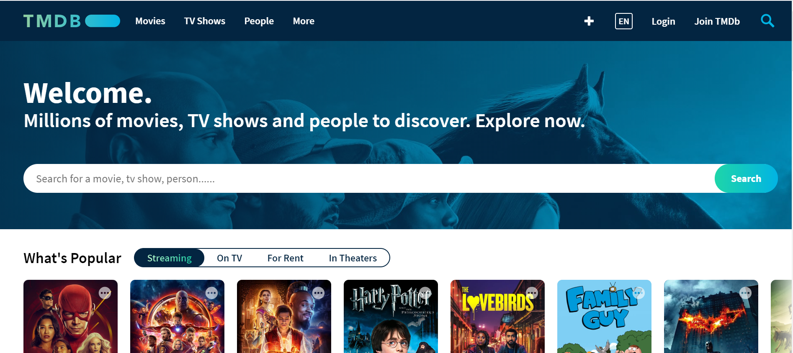

# TheOpenMovieDB-React-Example

<h1 align="center">
    
</h1>

<h2 align="center">
	🎬 The Open Movie Database Clone - React Monorepo 🚀
</h2>

<h3 align="center">

  <a href="https://github.com/AlexMachin1997/TheOpenMovieDB-React-Example/blob/master/package.json">
    
  </a>

  <a href="https://github.com/AlexMachin1997/TheOpenMovieDB-React-Example/blob/master/package.json" target="_blank">
    
  </a>

  <a href="https://github.com/AlexMachin1997/TheOpenMovieDB-React-Example/commits/master" target="_blank">
    
  </a>

  <a href="https://github.com/AlexMachin1997/TheOpenMovieDB-React-Example/blob/master/LICENSE.md" target="_blank">
    
  </a>

  <a href="https://github.com/storybooks/storybook" target="_blank">
    
  </a>

  

  
</h3>

## 📖 About

A modern React-based clone of [The Movie Database (TMDB)](https://www.themoviedb.org/) built as a monorepo using [Turborepo](https://turbo.build/repo) and [pnpm](https://pnpm.io/). This project demonstrates best practices for building scalable React applications with shared configurations and components.

<h3 align="center">
    
</h3>

## 🏗️ Project Structure

This monorepo is organized using [Turborepo](https://turbo.build/repo) for efficient build orchestration and [pnpm](https://pnpm.io/) for package management.

```
TheOpenMovieDB-React-Example/
├── apps/
│   └── the-open-movie-database/     # Main React application
├── packages/
│   ├── eslint-config/               # Shared ESLint configurations
│   └── typescript-config/          # Shared TypeScript configurations
├── turbo.json                       # Turbo configuration
├── pnpm-workspace.yaml             # pnpm workspace configuration
└── package.json                    # Root package.json
```

## 🚀 Features

### Core Functionality

- **Movie & TV Show Search**: Comprehensive search across movies, TV shows, and celebrities
- **Category Browsing**: Browse by Popular, Airing Today, Upcoming, and more
- **Detailed Views**: Rich detail pages for movies, TV shows, and celebrities
- **Advanced Filtering**: Filter celebrities by media type and department
- **Discovery System**: Interactive sidebar with advanced filtering options
- **Offline Support**: Apollo InMemoryCache for offline content viewing
- **Theme Switching**: Dark and light theme support

### Development Features

- **Monorepo Architecture**: Efficient development with shared configurations
- **Component Library**: Storybook for component development and documentation
- **Type Safety**: Full TypeScript support across the project
- **Code Quality**: ESLint and Prettier for consistent code style
- **Testing**: Comprehensive test suite with Vitest
- **Modern Build**: Vite for fast development and optimized builds

## 🛠️ Technology Stack

### Core Technologies

- **[React 18](https://react.dev/)** - Modern React with concurrent features
- **[TypeScript](https://www.typescriptlang.org/)** - Type-safe JavaScript
- **[Vite](https://vitejs.dev/)** - Fast build tool and dev server
- **[Tailwind CSS](https://tailwindcss.com/)** - Utility-first CSS framework
- **[React Router](https://reactrouter.com/)** - Client-side routing

### State Management & Data

- **[Apollo Client](https://www.apollographql.com/docs/react/)** - GraphQL client with caching
- **[GraphQL](https://graphql.org/)** - Data query language
- **[React Helmet](https://github.com/nfl/react-helmet)** - Document head management

### UI & Components

- **[Headless UI](https://headlessui.com/)** - Unstyled, accessible UI components
- **[Tippy.js](https://atomiks.github.io/tippyjs/)** - Tooltip library
- **[Font Awesome](https://fontawesome.com/)** - Icon library
- **[Storybook](https://storybook.js.org/)** - Component development environment

### Development Tools

- **[Turborepo](https://turbo.build/repo)** - High-performance build system
- **[pnpm](https://pnpm.io/)** - Fast, disk space efficient package manager
- **[ESLint](https://eslint.org/)** - Code linting
- **[Prettier](https://prettier.io/)** - Code formatting
- **[Vitest](https://vitest.dev/)** - Unit testing framework

### Shared Packages

- **[@repo/eslint-config](./packages/eslint-config/)** - Shared ESLint configurations
- **[@repo/typescript-config](./packages/typescript-config/)** - Shared TypeScript configurations

## 🚀 Getting Started

### Prerequisites

- **Node.js** >= 18
- **pnpm** >= 9.0.0

### Installation

1. **Clone the repository**

   ```bash
   git clone https://github.com/AlexMachin1997/TheOpenMovieDB-React-Example.git
   cd TheOpenMovieDB-React-Example
   ```

2. **Install dependencies**

   ```bash
   pnpm install
   ```

3. **Start the development server**

   ```bash
   pnpm dev
   ```

4. **Open your browser**
   Navigate to `http://localhost:5173`

### Backend Setup

This frontend application requires the GraphQL backend to be running. The backend repository can be found at:
**[TheOpenMovieDB-GraphQL-Example](https://github.com/AlexMachin1997/TheOpenMovieDB-GraphQL-Example)**

## 📜 Available Scripts

### Root Commands

```bash
pnpm dev          # Start development server
pnpm build         # Build all packages and applications
pnpm lint          # Run ESLint across all packages
pnpm prettier      # Format code with Prettier
pnpm check-types   # Run TypeScript type checking
pnpm test          # Run tests across all packages
pnpm clean         # Clean all build artifacts and node_modules
```

### App-specific Commands

```bash
cd apps/the-open-movie-database

pnpm dev          # Start Vite development server
pnpm build        # Build for production
pnpm storybook    # Start Storybook development server
pnpm test         # Run tests with Vitest
pnpm coverage     # Generate test coverage report
```

## 🧪 Development

### Component Development

This project uses [Storybook](https://storybook.js.org/) for component development:

```bash
pnpm storybook
```

Navigate to `http://localhost:6006` to view the component library.

### Code Quality

- **ESLint**: Configured with shared rules from `@repo/eslint-config`
- **Prettier**: Automatic code formatting
- **TypeScript**: Strict type checking across the project

### Testing

- **Vitest**: Fast unit testing framework
- **Testing Library**: React component testing utilities
- **Coverage**: Built-in coverage reporting

## 📚 Documentation

### Package Documentation

- **[ESLint Config](./packages/eslint-config/README.md)** - Shared ESLint configurations
- **[TypeScript Config](./packages/typescript-config/README.md)** - Shared TypeScript configurations

### External Resources

- **[Turborepo Documentation](https://turbo.build/repo/docs)** - Monorepo build system
- **[Vite Documentation](https://vitejs.dev/guide/)** - Build tool and dev server
- **[React Documentation](https://react.dev/)** - React library
- **[Tailwind CSS Documentation](https://tailwindcss.com/docs)** - CSS framework
- **[Storybook Documentation](https://storybook.js.org/docs/react/get-started/introduction)** - Component development

## 🤝 Contributing

We welcome contributions! Please see our [Contributing Guidelines](CONTRIBUTING.md) for details.

### How to Contribute

1. **Fork the repository**
2. **Create a feature branch** (`git checkout -b feature/amazing-feature`)
3. **Commit your changes** (`git commit -m 'Add some amazing feature'`)
4. **Push to the branch** (`git push origin feature/amazing-feature`)
5. **Open a Pull Request**

### Reporting Issues

Found a bug? Please report it [here](https://github.com/AlexMachin1997/TheOpenMovieDB-React-Example/issues).

### Feature Requests

Have an idea for a new feature? Please share it [here](https://github.com/AlexMachin1997/TheOpenMovieDB-React-Example/issues).

## 📄 License

This project is licensed under the MIT License - see the [LICENSE.md](LICENSE.md) file for details.

## 👨‍💻 Author

**Alex Machin**

- **LinkedIn**: [Alex Machin](https://www.linkedin.com/in/alex-machin/)
- **Twitter**: [@AlexMachin97](https://twitter.com/AlexMachin97)

## 🙏 Acknowledgments

- **[The Movie Database (TMDB)](https://www.themoviedb.org/)** - For the inspiration and API
- **[Turborepo](https://turbo.build/repo)** - For the excellent monorepo tooling
- **[Vite](https://vitejs.dev/)** - For the fast development experience
- **[Storybook](https://storybook.js.org/)** - For component development tools

## 📈 Version History

- **v0.1.0** - Initial release with basic functionality
- Future versions will follow [Semantic Versioning](https://semver.org/)

---

⭐ **Star this repository if you found it helpful!**
