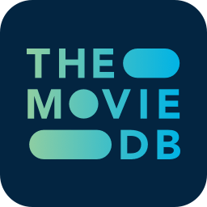

<h1 align="center">
    
</h1>

<h2 align="center">
	:construction: &nbsp;&nbsp;TheOpenMovieDB-React-Example 🚀&nbsp;&nbsp; In progress.. :construction:
</h2>

<h3 align="center">

  

  

  

  

  

  

  
</h3>

## About the project

This project contains of all the source code for my current personal project, [The Open Movie DB](https://www.themoviedb.org/) clone.

**This project will only contain the front-end code, the back-end code will be stored in a seperate repository which can be found [here](https://github.com/AlexMachin1997/TheOpenMovieDB-Graphql-Example)**

<h3 align="left">
    
</h3>

## README contents

As part of the README file it will describe and explain the following sections:

- Purpose
- Core features
- Technologies used
- Getting started
- Unit and integration testing setup
- Reporting issues
- Feature requests
- Project information

## Purpose

The whole idea by this web application is to allow me to develop a PWA using some of the latest and best technologies around, some of which include React, Apollo, Graphql etc. However, while it is primarily for me to push my skills further it will also allow users to search for the very latest movies, tv shows, people and more all through a single web application.

## Core features

As of the current version of the API, it is currently capable of performing the following tasks:

- Search for Movies, TV Shows and Celebrities via a search bar

- Search for Movies, TV Shows and Celebrities via individual categories like Popular, Airing Today, Upcoming etc

- View individual Movies, TV Shows and celebrities

- Filter through a celebrities backlog by media type (shows or movies or all) and department (Writing, Acting, Production etc).

- Discover the latest Movies and TV Shows via an interactive sidebar. Users will be able to filter by rating, release date, genre, score, keywords and where to watch, this won't be avaliable for Celebrities.

- View content offline (Apollo InMemoryCache will store content in the cache once the user has visited it before. Later on the cache will be persisted, but for now it will be on a per session basis)

- Switch between dark and light theme (Will be stored in Apollo cache, no custom React Provider//Context will be used)

## Technologies used:

### Core Dependencies

- [apollo-client](https://www.npmjs.com/package/apollo-client)
- [graphl](https://www.npmjs.com/package/graphql)
- [graphql-tag](https://www.npmjs.com/package/graphql-tag)
- [prop-types](https://www.npmjs.com/package/prop-types)
- [react](https://www.npmjs.com/package/react)
- [react-dom](https://www.npmjs.com/package/react-dom)
- [react-router-dom](https://reactrouter.com/docs/en/v6/getting-started/overview)
- [react-scripts](https://www.npmjs.com/package/react-scripts)
- [workbox-build](https://www.npmjs.com/package/workbox-build)

### Development Dependencies

- [@storybook/addon-actions](https://www.npmjs.com/package/@storybook/addon-actions)
- [@storybook/addon-links](https://www.npmjs.com/package/@storybook/addon-links)
- [@storybook/addons](https://www.npmjs.com/package/@storybook/addons)
- [@storybook/preset-create-react-app](https://www.npmjs.com/package/@storybook/preset-create-react-app)
- [@storybook/react](https://www.npmjs.com/package/@storybook/react)
- [@storybook/addon-knobs](https://www.npmjs.com/package/@storybook/addon-knobs)
- [@storybook/addon-docs](https://www.npmjs.com/package/@storybook/addon-docs)
- [@storybook/addon-a11y](https://www.npmjs.com/package/@storybook/addon-a11y)
- [@testing-library/jest-dom](https://www.npmjs.com/package/@testing-library/jest-dom)
- [@testing-library/react](https://www.npmjs.com/package/@testing-library/react)
- [@testing-library/user-event](https://www.npmjs.com/package/@testing-library/user-event)
- [eslint-config-airbnb](https://www.npmjs.com/package/eslint-config-airbnb)
- [esling-config-prettier](https://www.npmjs.com/package/eslint-config-prettier)
- [eslint-plugin-import](https://www.npmjs.com/package/eslint-plugin-import)
- [eslint-plugin-react](https://www.npmjs.com/package/eslint-plugin-react)
- [eslint-plugin-react-hooks](https://www.npmjs.com/package/eslint-plugin-react-hooks)
- [eslint-plugin-prettier](https://www.npmjs.com/package/eslint-plugin-prettier)
- [prettier](https://www.npmjs.com/package/prettier)
- [jest-axe](https://www.npmjs.com/package/jest-axe)

## Getting started

- Clone the project to your development environment by using `git clone https://github.com/AlexMachin1997/TheOpenMovieDB-React-Example.git`

- Install all dependencies for the application by issuing this command `npm coreDependencies` **(Excludes all development dependencies e.g. react-testing-library, jest-axe etc)**

## Unit and integration testing setup

To get started with the testing suites you will need to install all the development dependencies used for the application. To install the dependencies use `npm run devDependencies`, this will install all the development decencies, this includes react-testing-library, storybook, jest-axe etc.

By installing the development dependencies you will be able to run the whole applications component, GraphQL and any other tests produced as part of the development of this project.

A complete list of all the tests which have been or are going to be created below

- Checks each components defaultProps
- Checks each components styling properties e.g. font-weight, border, border-radius etc
- Checks each components events e.g. onClick, onChange etc **(COMING SOON)**
- Checks each components states e.g. checked, toggled etc **(COMING SOON)**
- Each GraphQL Query will be mocked via MockedProvider **(COMING SOON)**
- All the react-router routes will be tested e.g. invalid paths, valid paths, 404's etc **(COMING SOON)**
- React-Hooks e.g. form validation **(COMING SOON)**

## Contributing

### Reporting issues

If you find any problems while using the API, report them [here](https://github.com/AlexMachin1997/TheOpenMovieDB-React-Example/issues), and I will address them as quick as I can.

### Feature requests

If you would like to request features for future versions of the application again, please post them [here](https://github.com/AlexMachin1997/TheOpenMovieDB-React-Example/issues). When posting ideas ensure the functionality is explained to provide any developers contributing to the project know what to implement.

### Implementing features

If you would like to implement a feature in the issues list or refactor existing code (Without breaking existing functionality), feel free to form the repo and submit a [PR](https://github.com/AlexMachin1997/TheOpenMovieDB-React-Example/pulls) detailing all the changes made.

# Project Information

### Author information

Alex Machin

If you want to connect with me on my professional social network platforms feel free to use the links located below, but please don't abuse them.

- [LinkedIn](https://www.linkedin.com/in/alex-machin/)
- [Twitter](https://twitter.com/AlexMachin97)

### Application Versioning

The application is currently at version 0.1.0, with each feature added it will increment based on these [guidelines](https://docs.npmjs.com/about-semantic-versioning)

### Project Licence information

This project is licensed under the MIT License, for more details about the PWA refer to the LICENSE.md file located within the project.
